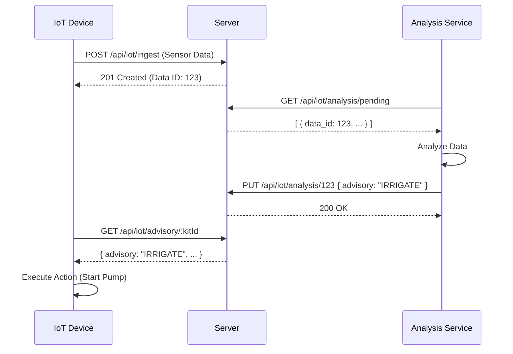

# IoT Advisory Workflow Documentation

## Overview

The Advisory Workflow enables an asynchronous decision-making process for IoT devices.
1. **IoT Device** uploads sensor data to the server.
2. **Analysis Service** (e.g., Raspberry Pi) polls for pending data, analyzes it, and updates the record with an advisory decision.
3. **IoT Device** polls for the latest advisory to execute actions (e.g., irrigation).

## Workflow Diagram



## API Endpoints

### 1. Get Pending Analysis
**Goal:** Retrieve data waiting for analysis.
- **URL:** `GET /api/iot/analysis/pending`
- **Response:** Array of `SensorData` objects where `advisory` is `null`.

### 2. Submit Advisory Decision
**Goal:** Submit the result of the analysis.
- **URL:** `PUT /api/iot/analysis/:dataId`
- **Body:**
```json
{
  "advisory": "IRRIGATE"
}
```

### 3. Get Latest Advisory
**Goal:** IoT Device fetches the latest instruction.
- **URL:** `GET /api/iot/advisory/:kitId`
- **Response:** The most recent `SensorData` record with a non-null advisory.

## Advisory Format & Values

The advisory system strictly accepts **two values** to ensure deterministic behavior on the IoT device.

### Acceptable Values

- **`"IRRIGATE"`**
  - **Meaning:** Soil moisture is insufficient.
  - **Device Action:** Open the water valve or start the pump immediately.

- **`"WAIT"`**
  - **Meaning:** Soil moisture conditions are sufficient.
  - **Device Action:** Keep the valve closed and do nothing.

### Payload Structure

When submitting an advisory, the body must be a JSON object with the `advisory` key.

```json
{
  "advisory": "IRRIGATE"
}
```

OR

```json
{
  "advisory": "WAIT"
}
```

## Data Structures

### SensorData Schema

When fetching pending analysis data, the service will receive an array of objects matching this schema:

```json
{
  "data_id": 1,
  "kit_id": "DS-3",
  "timestamp": "2023-10-27T10:00:00.000Z",
  "moisture": 45.5,
  "temperature": 25.0,
  "nitrogen": 12.0,
  "phosphorus": 5.5,
  "potassium": 8.0,
  "ph": 6.5,
  "battery": 98.0,
  "signal": -60.0,
  "firmware": 1.2,
  "ec": 1.5,
  "advisory": null 
}
```

### Field Descriptions

- **`data_id`** (`Number`)
  - Unique identifier for the sensor data record.
  - **Important:** Use this ID when submitting the `PUT` request to update the advisory.

- **`kit_id`** (`String`)
  - Unique identifier for the IoT Kit (e.g., "DS-3").

- **`timestamp`** (`String`)
  - ISO 8601 timestamp of when the data was recorded (e.g., "2023-10-27T10:00:00.000Z").

- **Sensor Data Fields** (`Number`)
  - **`moisture`**: Soil moisture level (%).
  - **`temperature`**: Ambient temperature (°C).
  - **`nitrogen`**: Nitrogen level in soil (mg/kg).
  - **`phosphorus`**: Phosphorus level in soil (mg/kg).
  - **`potassium`**: Potassium level in soil (mg/kg).
  - **`ph`**: Soil pH level.
  - **`ec`**: Electrical Conductivity (mS/cm).

- **Device Health Fields** (`Number`)
  - **`battery`**: Device battery percentage (0-100).
  - **`signal`**: Signal strength (RSSI in dBm).
  - **`firmware`**: Device firmware version.

- **`advisory`** (`String` | `null`)
  - The decision string.
  - Will be `null` when fetched from the `pending` endpoint.
  - After analysis, this field will be populated with the decision (e.g., "IRRIGATE").

### UpdateAdvisoryDto
```typescript
class UpdateAdvisoryDto {
  advisory: string; // The decision string
}
```
